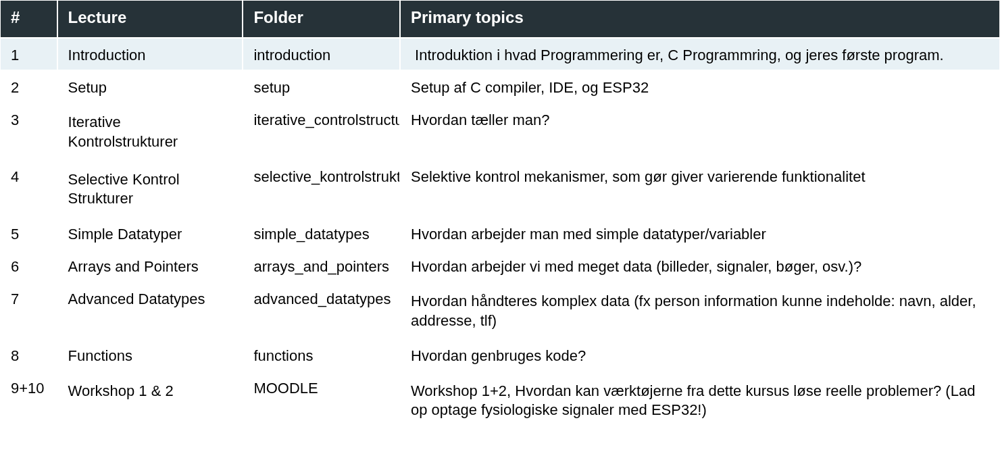

# Forord



Du kan få alle lectures i dette kursus ved at køre følgende linje i din terminal:

## Installations Krav
For at kunne bruge dette, skal du have følgende programmer installeret
- `git`
- `python3`

## Download Github repositories
>```
>python setup_repositories.py
>```


## Updates 
2. If change occur in a repository (online), while in the repository directory, i.e. `C:/AAU-ST1-IP/introduktion` write this in terminal `git pull`


# Literatur Oversigt

## Bøger
- [Quantitative Human Physiology, 2nd Edition](https://shop.elsevier.com/books/quantitative-human-physiology/feher/978-0-12-800883-6)
- [Data Wrangling with Python (eBook/PDF)](https://datawranglingpy.gagolewski.com/datawranglingpy.pdf)
## Hjemmesider
- https://docs.python.org/3/library/index.html
- https://www.tutorialspoint.com/python/index.htm
- https://numpy.org/doc/stable/reference/index.html
- https://matplotlib.org/stable/
- https://scikit-learn.org/stable/
- https://docs.conda.io/projects/conda/en/stable/user-guide/index.html
